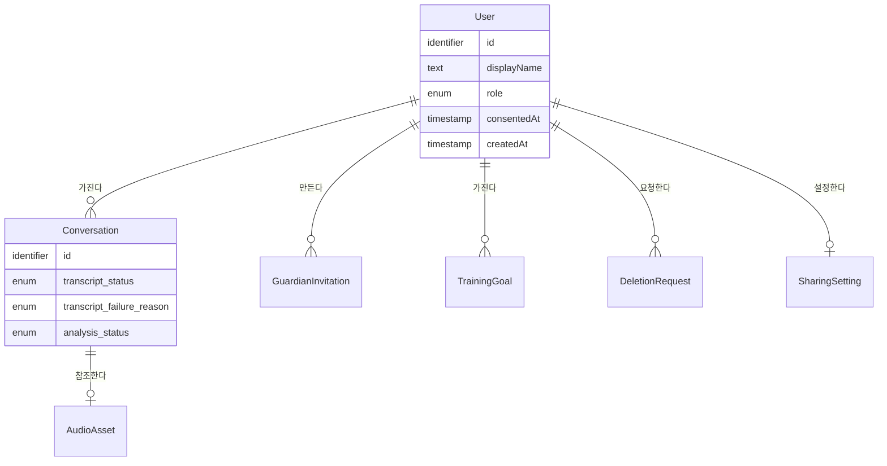

# Functional Spec — u1-backend-foundation

**Stage**: functional-design (3.1) · **Unit**: u1-backend-foundation (U1 백엔드 기반)
**작성일**: 2026-09-18

## Sources

| 태그 | 출처 |
|---|---|
| `[unit]` | `aidlc/spaces/default/intents/260916-scd-coaching-mvp/inception/units-generation/unit-of-work.md` — U1 정의 |
| `[map]` | `aidlc/spaces/default/intents/260916-scd-coaching-mvp/inception/units-generation/unit-of-work-story-map.md` — US9.1 → US9.2 순서 |
| `[req]` | `aidlc/spaces/default/intents/260916-scd-coaching-mvp/inception/requirements-analysis/requirements.md` — FR11.1, NFR5, NFR10, NFR12 |
| `[components]` | `aidlc/spaces/default/intents/260916-scd-coaching-mvp/inception/domain-design/components.md` — Account, ProviderAdapters |
| `[contract]` | `aidlc/spaces/default/intents/260916-scd-coaching-mvp/inception/contract-design/contract-summary.md` — 공통 규칙, C1, C14, C15, C16 |
| `[Q<n>]` | `functional-design-questions.md` |
| `[entities]` | 같은 디렉터리의 `entities.md` — 엔티티 모델의 기준 |
| `[rules]` | 같은 디렉터리의 `rules.md` — 업무 규칙의 기준 |

**이 문서가 기준인 것** — 흐름(번호가 붙은 단계 순서)과 상태 기계. 엔티티의 모양은 `entities.md`, 규칙의 내용은
`rules.md` 가 기준이며, 아래 §5 의 관계도와 §6 의 규칙 표는 그 둘에서 **뽑아 온 사본**이다. 어긋나 보이면 원본이
기준이다.

**이 단위가 만드는 것** — 다른 모든 백엔드 단위가 올라탈 실행 가능한 백엔드, Mock 어댑터, 그리고 시드·픽스처를
넣는 방법 `[unit]`. 기능별 업무 규칙(판정 저장, 추천, 삭제 전파)은 여기 없다.

---

## 1. 흐름

### W1. 기동

가장 중요한 흐름이다. 시연 중 실제 외부 호출로 흐르거나 설정 오류로 멈추지 않게 하는 것이 US9.1 의 목적이다
`[map]`.

1. 설정을 한 번 읽는다. 환경변수를 해석해 설정 값 묶음 하나를 만든다. 이후 어느 자리도 환경변수를 다시 읽지
   않는다 (BR1.3).
2. 분석 모드를 정한다.
   - 값이 없거나, 비어 있거나, 아는 값이 아니면 → **mock** 으로 정하고, 그 사실을 로그에 남긴다 (BR1.1).
   - 값이 `live` 면 → 3 으로 간다.
   - 값이 `mock` 이면 → 4 로 간다.
3. `live` 확인. 필요한 제공자 키가 하나라도 없으면 **기동을 중단**하고 어떤 키가 없는지를 로그에 남긴다.
   mock 으로 되돌아가지 않고, 첫 요청까지 미루지도 않는다 (BR1.2).
4. 제공자를 고른다. 정해진 모드에 맞는 전사·판정 어댑터를 만들어 둔다. **mock 모드에서는 live 구현이 전혀
   불러와지지 않아야 한다** — 인터페이스와 구현을 같은 자리에 두지 않는 이유가 이것이다 `[contract]` C14.
5. 저장소 연결을 준비한다. 연결 설정을 만들고, 응답 이후 작업이 쓸 작업 단위 장치를 노출한다 (BR5.2).
6. 요청 처리 준비. 요청 식별자를 발급하는 자리, 오류를 공통 봉투로 바꾸는 자리, 경로 등록을 조립한다 (BR6.1).
7. 기동 완료. 이 시점부터 헬스체크가 응답한다.

**스키마와의 관계** — 테이블 만들기는 기동 흐름에 넣지 않는다. 스키마는 마이그레이션을 적용하는 별도 단계로
올리고, 기동은 이미 적용된 스키마를 전제한다. 테스트도 같은 마이그레이션으로 스키마를 만든다 — 그래야
마이그레이션이 실제로 한 번은 실행된다.

### W2. 헬스체크 조회

1. 요청을 받는다.
2. 저장소에 가벼운 확인 질의를 하나 보낸다 (BR3.1).
3. 응답이 오면 → 정상 상태와 **현재 분석 모드**를 함께 답한다 (BR3.2).
4. 응답이 없거나 실패하면 → 정상이 아니라고 답한다. 컨테이너 단위 확인이 이 결과를 그대로 쓴다.

이 흐름이 AC9.1.1 의 "세 컨테이너가 뜨고 헬스체크가 통과한다"를 실제 확인으로 만든다. 프로세스만 보는 확인은
저장소가 아직 안 뜬 상태도 통과시키므로 쓰지 않는다 `[Q4]`.

### W3. 현재 사용자 조회

1. 요청을 받는다. 인증 정보는 요구하지 않는다 (BR2.3).
2. 시드 고정 사용자를 찾는다.
3. 식별자·이름·역할·동의 시각을 답한다. 동의 시각이 비어 있으면 아직 동의 전이라는 뜻이다 `[contract]` C1.

### W4. 첫 방문 동의

1. 동의 요청을 받는다.
2. 이미 동의한 사용자면 → 처음 동의 시각을 그대로 두고 성공으로 답한다 (BR2.2).
3. 아직 동의 전이면 → 동의 시각을 지금으로 적고 확정한다 (BR5.3).
4. 갱신된 사용자 정보를 답한다.

화면이 동의 전에 다른 화면으로 가지 못하게 막는 일은 u2-web-foundation 이 한다. 이 단위는 서버 쪽 상태만
소유한다 `[components]`.

### W5. 응답 이후에 도는 작업의 저장소 연결 (일반형)

전사(u3)·분석(u5)·재분석(u9)이 모두 이 모양을 따른다. U1 은 그 모양을 만들어 두고, 실제 작업 내용은 각 단위가
채운다 `[Q3]`.

1. 요청 경로가 작업을 예약한다. 이때 **식별자만** 넘긴다. 열린 연결을 넘기지 않는다 (BR5.1).
2. 요청은 접수 응답을 내고 끝난다. 이 시점에 요청의 연결은 닫힌다 `[contract]` 공통 규칙.
3. 작업이 시작된다. 자기 작업 식별자를 새로 발급하고, 자신을 낳은 요청의 식별자를 함께 로그에 남긴다 (BR6.2).
4. 작업이 **작업 단위 장치**를 통해 자기 연결을 연다 (BR5.2).
5. 작업 내용을 수행한다.
6. 성공하면 → 장치가 한 번 확정하고 닫는다 (BR5.3).
7. 실패하면 → 장치가 되돌린 뒤, **별도의 연결로** 대상의 상태를 실패로 적고 닫는다. 실패 사유는 로그에 남기되
   전사 본문은 남기지 않는다 (BR6.3).

7 번이 별도 연결을 쓰는 이유는, 되돌린 연결로는 실패 기록도 함께 사라지기 때문이다.

### W6. 시드 적재

1. 넣을 상태 이름을 받는다. 상태는 누적이다 — 뒤 상태가 앞 상태를 포함한다 `[contract]` C16.
2. `base` — 고정 사용자 한 명을 **동의 전** 상태로 만들고(BR2.1), 시나리오 원형과 검토된 변형을 넣는다.
3. 그 뒤 상태들은 앞 상태 위에 쌓는다. 값은 픽스처 파일에서 읽고 **다시 적지 않는다** (BR4.3).
4. U1 이 이번에 넣는 것은 `base`·`consented`·`s1-transcribed` 세 상태다. 나머지 여섯은 갈래 4 가 병렬 기간 첫
   주 안에 더한다 `[unit]` (D-115).

---

## 2. 상태 기계

### SM-A. 대화의 전사 상태

```
[없음] --대화 생성--> UPLOADING --파일 저장 완료--> TRANSCRIBING --전사 성공--> TRANSCRIBED
                         |                                  |
                  저장 실패|                                  |전사 실패
                         v                                  v
          TRANSCRIBE_FAILED(사유=STORAGE)    TRANSCRIBE_FAILED(사유=TRANSCRIPTION)
                         |                                  |
      다시 시도(저장부터)  |                                  |다시 시도(전사만)
                         v                                  v
                     UPLOADING                         TRANSCRIBING
```

<!-- Text fallback: 대화가 만들어지면 UPLOADING 으로 시작한다. 파일 저장이 끝나면 TRANSCRIBING 으로 가고, 전사가 성공하면 TRANSCRIBED 가 된다. 저장이 실패하면 TRANSCRIBE_FAILED 가 되고 실패 사유는 STORAGE 다. 전사가 실패해도 TRANSCRIBE_FAILED 가 되지만 실패 사유는 TRANSCRIPTION 이다. 다시 시도할 때 사유가 STORAGE 면 UPLOADING 으로 돌아가 저장부터 다시 하고, 사유가 TRANSCRIPTION 이면 TRANSCRIBING 으로 가서 전사만 다시 돈다. TRANSCRIBED 에서 나가는 전이는 없다. -->

- **실패 상태는 하나지만 회복 경로는 둘이다.** 실패 사유 값이 그 둘을 가른다 (BR7.5). 저장이 실패한 경우
  디스크에 파일이 없으므로 전사만 다시 돌릴 수 없고, 저장부터 다시 해야 한다. 계약 C2 의 다시 시도 경로는 이
  구분을 받아 어느 쪽으로 갈지 정한다.
- `TRANSCRIBED` 는 끝 상태다. 재분석은 이 값을 건드리지 않는다 (BR7.3).
- 이 전이를 실제로 일으키는 코드는 u3-f01-capture 가 쓴다. U1 은 값의 목록과 위 규칙을 스키마와 규칙 문서로
  고정한다.

### SM-B. 대화의 분석 상태

```
NOT_ANALYZED --분석 시작--> ANALYZING --판정 저장 완료--> ANALYZED
                               |                            |
                               +--실패--> ANALYZE_FAILED     +--재분석 시작--+
                                             |                              |
                                             +--다시 시도--> ANALYZING <-----+
```

<!-- Text fallback: 분석 상태는 NOT_ANALYZED 로 시작한다. 분석이 시작되면 ANALYZING 이 되고, 판정이 저장되면 ANALYZED 가 된다. 실패하면 ANALYZE_FAILED 가 되고 다시 시도하면 ANALYZING 으로 돌아간다. ANALYZED 상태에서 재분석을 시작하면 다시 ANALYZING 이 된다. -->

- `ANALYZING` 으로 들어가려면 전사 상태가 `TRANSCRIBED` 여야 한다 (BR7.1).
- 이미 `ANALYZING` 이면 새 요청을 받지 않는다 (BR7.2).
- 두 상태 값은 서로 독립이다. 이 독립성이 F07 재분석 중에도 화면이 전사를 계속 보여 줄 수 있게 한다 `[Q2]`.

**말이 되지 않는 조합** — 아래가 전체 목록이며, 규칙이 모두 막는다.

| 전사 상태 | 분석 상태 | 왜 안 되는가 |
|---|---|---|
| `UPLOADING` / `TRANSCRIBING` | `ANALYZING` · `ANALYZED` · `ANALYZE_FAILED` | 재료가 아직 없다 (BR7.1) |
| `TRANSCRIBE_FAILED` | `ANALYZING` · `ANALYZED` · `ANALYZE_FAILED` | 전사가 없는데 판정이 성공하거나 실패할 수 없다 (BR7.1) |

`ANALYZE_FAILED` 도 분석이 **시작되었다는** 사실을 뜻하므로 위 두 줄에 함께 들어간다. 분석이 한 번도 시작되지
않은 상태는 `NOT_ANALYZED` 하나뿐이고, 그것만이 전사 완료 전에 나올 수 있다.

### 내부 값과 계약 값은 다르다

위 상태값은 모두 **저장소 안의 값**이다. API 응답에는 계약 C2 가 정한 다른 이름으로 나간다
(`TRANSCRIBED` → `READY`, `NOT_ANALYZED` → `NOT_STARTED` 등). 대응표와 변환 위치·책임 단위는 `entities.md` §4 가
기준이며, 그 경계를 지키는 규칙은 BR7.4 다. 전사 실패 사유는 응답에 싣지 않는다.

### SM-C. 사용자의 동의 상태

```
[동의 전] --동의 저장--> [동의 완료]
```

<!-- Text fallback: 사용자는 동의 전 상태로 시작하고, 동의를 저장하면 동의 완료가 된다. 되돌아가는 전이는 없다. -->

- 되돌아가는 전이가 없다 (BR2.2). 동의 철회는 이번 범위 밖이다.
- 시드가 만드는 사용자는 반드시 왼쪽에서 시작한다 (BR2.1) — 종단 시험이 동의 화면부터 지나야 하기 때문이다.

---

## 3. 이 단위가 다른 단위에 넘기는 것

| 넘기는 것 | 받는 단위 | 이 문서의 어디 |
|---|---|---|
| 실행 가능한 백엔드와 기동 규칙 | 모든 백엔드 단위 | W1 |
| 저장소가 실제로 붙었는지 알려 주는 확인 지점 | 시연 리허설, 컨테이너 구성 | W2 |
| 인증 없이 도는 고정 사용자와 동의 상태 | u2-web-foundation, 모든 Must 흐름 | W3, W4, SM-C |
| 응답 이후 작업의 연결 수명 모양 | u3(전사), u5(분석), u9(재분석) | W5 |
| 전사·판정 어댑터 인터페이스와 Mock 구현 | u3, u5, u7 | W1 4단계, BR4.1~BR4.3 |
| 합성 대화 자료의 단일 출처 | Mock 제공자, 단위 테스트, 프론트엔드 모의 응답, 종단 시험 | BR4.3 |
| 테이블 20개의 초기 스키마 | 모든 백엔드 단위 | `entities.md` §3 |
| 시드 상태를 넣는 방법 | 모든 단위 | W6 |

**이 단위가 넘기지 않는 것** — 판정 저장 규칙, 추천, 삭제 전파는 U1 의 경계 밖이다 `[unit]`. Mock 판정 픽스처의
자리는 만들지만 그 값이 무엇을 뜻하는지는 u5·u7 이 해석한다.

---

## 4. 이 단위를 어떻게 확인하는가

US9.1·US9.2 의 수용 기준을 그대로 옮긴 것이며 새 기준을 만들지 않았다 `[map]`.

| 수용 기준 | 확인 방법 | 관련 규칙 |
|---|---|---|
| AC9.1.1 한 명령으로 세 컨테이너가 뜨고 헬스체크 통과 | 리허설 — 새로 받은 트리에서 한 번 올린다 | BR3.1 |
| AC9.1.2 분석 모드 미설정·빈 값·모르는 값이면 mock | 설정 해석 단위 시험 3건 + 헬스체크 통합 시험 | BR1.1, BR3.2 |
| AC9.1.3 키 없는 live 는 기동 거부 | 기동 거부 단위 시험 | BR1.2 |
| AC9.1.4 새로 받은 트리에 실제 값이 든 환경 파일이 없다 | 리허설 확인 | BR6.4 |
| AC9.2.1 시드 적재 후 로그인 없이 고정 사용자, 동의 전 시작 | 통합 시험 — 사용자 조회와 동의 저장 | BR2.1, BR2.3 |
| AC9.2.2 알려진 대화 키로 S2·S3 처리 | Mock 제공자 단위 시험 | BR4.1 |
| AC9.2.3 키 없음·모르는 키·녹음이면 S1 | Mock 제공자 단위 시험 3건 | BR4.2 |

덧붙여, 팀 관행이 요구하는 이 단위 몫의 확인이 둘 더 있다 — Mock 이 픽스처와 정확히 같은 값을 돌려주는지 대조하는
시험(BR4.3)과, 전사를 프롬프트의 데이터 구역 안에만 넣는지 확인하는 프롬프트 조립 시험이다. 후자는 Mock 경로에서
살아남는 유일한 보안 속성이라 이 단위가 자리를 만들어 둔다.

---

## 5. 관계도 (`entities.md` 에서 뽑아 온 사본)

기준은 `entities.md` 다. 아래는 사용자와 직접 이어지는 부분만 그린 것이며, 초기 리비전이 만드는 20개 전체 목록은
`entities.md` §3 에 있다.



<!-- Text fallback: User 하나는 여러 개의 Conversation, GuardianInvitation, TrainingGoal, DeletionRequest 를 가질 수 있고, SharingSetting 은 사용자당 최대 하나다. Conversation 하나는 AudioAsset 을 최대 하나 참조한다. User 는 id, displayName, role, consentedAt, createdAt 을 가지고, Conversation 은 id 와 전사 상태·전사 실패 사유·분석 상태 세 값을 가진다. User 를 뺀 나머지 엔티티의 속성 상세는 각 소유 단위가 정한다. -->

---

## 6. 규칙 요약 (`rules.md` 에서 뽑아 온 사본)

기준은 `rules.md` 다.

| 묶음 | 무엇을 지키는가 |
|---|---|
| BR1 | 분석 모드가 안전한 쪽으로만 닫힌다 — 모르면 mock, 키 없는 live 는 기동 거부 |
| BR2 | 동의 전으로 시작하는 고정 사용자, 되돌리지 않는 동의 |
| BR3 | 헬스체크가 저장소까지 확인하고 분석 모드를 알린다 |
| BR4 | 시연이 매번 같은 결과로 재현된다 — 대화 키 선택, 모르면 S1, 픽스처가 단일 출처 |
| BR5 | 응답 이후 작업이 자기 연결을 열고 한 장치가 수명을 맡는다 |
| BR6 | 무슨 일이 있었는지 되짚을 수 있다 — 식별자, 전사 본문 제외, 비밀값 커밋 금지 |
| BR7 | 두 상태 값의 조합이 말이 되고, 안과 밖의 이름이 섞이지 않는다 — 내부 값은 응답에 그대로 나가지 않고, 실패 사유에 따라 다시 시도의 시작점이 갈린다 |
| BR8 | 초기 스키마는 확정된 것만 담는다 |

---

## Assumptions & Open Questions

### 가정

- 스키마 적용을 기동 흐름 밖의 별도 단계로 둔 것은 리드 판단이다. 기동할 때마다 마이그레이션이 도는 모양은
  여러 컨테이너가 동시에 뜨는 상황에서 경쟁이 생기고, 팀 관행이 전진 방향만 쓰기로 한 것과도 결이 맞지 않는다.
- W5 의 7번(실패 기록을 별도 연결로 적는다)은 계약 공통 규칙의 문장을 흐름으로 편 것이며 새 요구가 아니다.

### 열린 질문

| ID | 질문 | 담당 단계 |
|---|---|---|
| OQ-F3 | 저장소가 아직 안 떴을 때 백엔드가 기동 자체를 기다릴지, 떠 있되 헬스체크만 실패로 둘지. 후자를 전제로 W2 를 썼으나 컨테이너 구성이 이것을 결정한다 | infrastructure-design (3.4) |
| OQ-F4 | 헬스체크 확인 질의의 시간 제한 값. 저장소가 잠깐 느릴 때 실패로 보이는 경계가 여기서 갈린다 | nfr-requirements (3.2) |
| OQ-F5 | 응답 이후 작업을 어떤 수단으로 예약할지(프레임워크 기본 수단 / 별도 실행자). W5 는 어느 쪽이든 성립하게 썼다 | 이 단위의 code-generation (3.5) |
