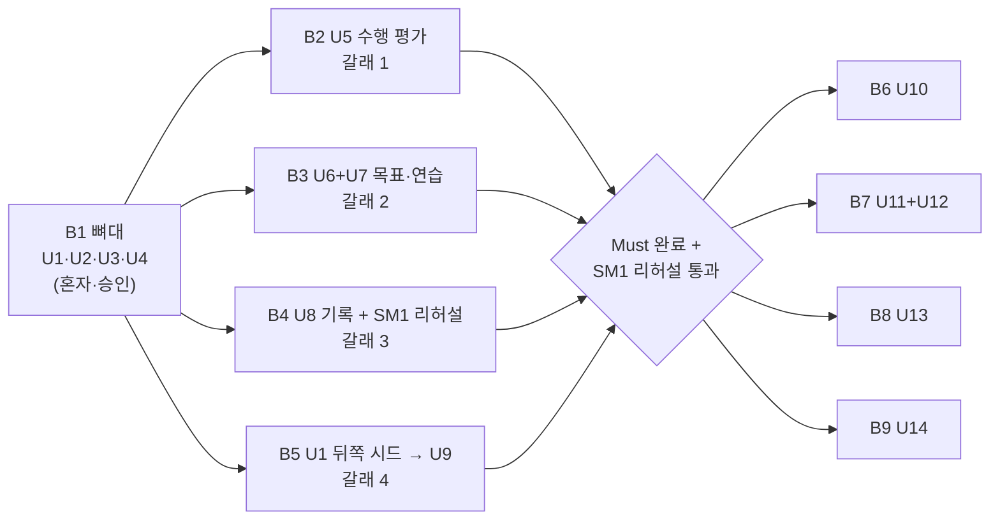

# Bolt Plan — SCD 소통 코칭 MVP

**Stage**: delivery-planning (2.9)
**작성일**: 2026-09-17

## Sources

| 태그 | 출처 |
|---|---|
| `[units]` | `aidlc/spaces/default/intents/260916-scd-coaching-mvp/inception/units-generation/unit-of-work.md`, `unit-of-work-dependency.md`, `unit-of-work-story-map.md` |
| `[contract]` | `aidlc/spaces/default/intents/260916-scd-coaching-mvp/inception/contract-design/contract-summary.md` |
| `[components]` | `aidlc/spaces/default/intents/260916-scd-coaching-mvp/inception/domain-design/components.md` |
| `[req]` | `aidlc/spaces/default/intents/260916-scd-coaching-mvp/inception/requirements-analysis/requirements.md` |
| `[stories]` | `aidlc/spaces/default/intents/260916-scd-coaching-mvp/inception/user-stories/stories.md` |
| `[practices]` | `aidlc/spaces/default/intents/260916-scd-coaching-mvp/inception/practices-discovery/team-practices.md` 와 `aidlc/spaces/default/memory/team.md` |
| `[Q<n>]` | `delivery-planning-questions.md` — 이 단계에서 사용자가 답한 내용 |
| `[log]` | `docs/decisions/decision-log.md` (D-108~D-117) |

team-formation(1.5)과 refined-mockups(2.5, mockups)는 범위 밖이다. 팀 구성표와 고충실도 화면이 입력에 없는 것은 결손이 아니라
범위 밖이며, 인원은 제약 OC-02·OC-03(5인 전원 풀스택, 고정 역할 없음)을, 화면은 `docs/input/03_ui-spec.md` 를 따른다.

**이 문서에서 쓰는 말**

- **Bolt** — Construction 에서 설계부터 코드·테스트까지 한 번에 지나가는 작업 묶음이다. 작업 단위(U1~U14) 하나 이상을 담고,
  끝나면 돌아가는 무언가와 병합된 커밋 하나(squash-merge)가 남는다.
- **걷는 뼈대** — 첫 Bolt 로 만드는, 화면부터 DB 와 Mock 까지 모든 층을 실제 기능 하나로 얇게 관통하는 경로다.
- **갈래** — 동시에 진행하는 작업 줄기다. 최대 4개다(D-91).
- **SM1** — 시연 필수선. 합성 대화 3건이 업로드부터 기록까지 끊김 없이 이어지는 것이다(D-45).

**이 문서가 정하지 않는 것** — 실행할 AI-DLC 단계와 깊이는 스코프가 정한다. 실제 동시 실행 묶음은 엔진이
`unit-of-work-dependency.md` 에서 계산한다. 이 문서는 사람이 따라갈 경제적 순서와 각 Bolt 의 완료 기준을 적는다.

---

## 순서 한눈에 보기

<!-- Text fallback: B1 뼈대(U1·U2·U3·U4)를 혼자 만들고 승인받는다. 승인 뒤 네 갈래가 동시에 시작한다 — 갈래 1 은 B2(U5 수행 평가), 갈래 2 는 B3(U6+U7 목표·연습), 갈래 3 은 B4(U8 기록과 SM1 리허설), 갈래 4 는 B5(U1 뒤쪽 시드 뒤 U9 정정·삭제). 네 Bolt 가 모두 끝나고 SM1 리허설을 통과하면 Should Bolt B6(U10), B7(U11+U12), B8(U13), B9(U14)를 빈 갈래에서 시작한다. -->

| 순서 | Bolt | 담는 단위 | 등급 | 갈래 | 시작 조건 |
|---|---|---|---|---|---|
| 1 | B1 뼈대 | U1(범위 제한) · U2 · U3 · U4 | Must | 혼자 | 저장소 준비와 GitHub Actions 확인(A6) |
| 2 | B2 | U5 | Must | 1 | B1 승인 |
| 2 | B3 | U6 + U7 | Must | 2 | B1 승인 |
| 2 | B4 | U8 | Must | 3 | B1 승인 (닫는 것은 B2·B3 병합 뒤) |
| 2 | B5 | U1 뒤쪽 시드 → U9 | Must | 4 | B1 승인 |
| 3 | B6 | U10 | Should | 빈 갈래 | B1~B5 완료 + SM1 리허설 통과 `[Q6]` |
| 3 | B7 | U11 + U12 | Should | 빈 갈래 | 같음 |
| 3 | B8 | U13 | Should | 빈 갈래 | 같음 |
| 3 | B9 | U14 | Should | 빈 갈래 | 같음 |

근거: 순서 원칙 `[Q7]` (D-114), 뼈대 구성 `[Q9]` (D-116), U1 범위 `[Q2][Q8]` (D-109, D-115), 묶음 `[Q3]` (D-110),
갈래 배정 `[Q4]` (D-111), 일정 보호선 `[Q6]` (D-113). 순서의 이유는 `risk-and-sequencing-rationale.md` 에 있다.

---

## Bolt 상세

### B1 — 걷는 뼈대: 업로드로 전 층 관통

- **담는 단위**: U1 백엔드 기반(테이블 20개 + 시드 base·consented·s1-transcribed 까지), U2 화면 기반, U3 녹음·전사, U4 맥락 `[Q9]`
- **걷는 뼈대 표시**: 예. 혼자 진행하고, 사람의 승인을 받은 뒤에만 나머지 Bolt 가 시작한다 `[practices]` Walking Skeleton
- **관통하는 층**: React 화면(A2 업로드) → FastAPI 엔드포인트(`POST /api/v1/conversations`) → service → repository → PostgreSQL →
  Mock STT 1회 → 상태 조회 → 화면 표시(A3 전사). Docker Compose 3 컨테이너(frontend, backend, postgres) 안에서 돈다 `[contract]` C2·C17
- **스토리**: US1.1·US1.2(U2), US2.1·US2.2·US3.1·US3.2(U3), US2.3(U4), US9.1·US9.2(U1) `[units]` story map
- **완료 기준**
  - `docker compose up --build` 한 명령으로 뜨고, `GET /api/v1/health` 가 `analysisMode: mock` 을 돌려준다(US9.1)
  - 첫 방문 동의 → 파일 업로드 → 202 접수 → 1초 간격 상태 조회 → 전사 READY → A3 에서 발화 확인·고치기, 맥락 네 항목 저장이 동작한다
  - **S1 종단 Playwright 테스트**가 이 경로를 통과하고, 이후 모든 Bolt 동안 초록으로 유지된다 `[practices]`
  - `localhost` 에서 HTTPS 없이 브라우저 직접 녹음(MediaRecorder)이 실제로 동작함을 한 번 확인한다(가정 A1)
  - 테이블 20개 초기 리비전이 `alembic upgrade head` 로 적용되고, Testcontainers 통합 테스트가 이 리비전으로 스키마를 만든다 `[contract]` C15
  - 시드 `base`·`consented`·`s1-transcribed` 가 `scripts/seed.py --state` 로 들어간다 `[contract]` C16
  - 오류 봉투·request_id·계층 경계 검사(Ruff `TID251`)가 동작하고, `service/` 라인 커버리지 80% 를 넘는다. 병합 전 강제는
    GitHub Actions 로 하되, 워크플로 자체는 ci-pipeline(3.7) 단계가 만든다 — 그전까지는 컨테이너 안 `scripts/check.sh` 로 확인한다 `[practices]`
  - `docs/glossary.md` 첫 판이 병합된다 `[practices]` Code Style
- **확신 가설** — 이 Bolt 가 증명하는 것: 팀이 처음 쓰는 조립 지점(FastAPI 의존성 주입, 동기 SQLAlchemy 세션 수명, Alembic 적용 시점,
  컨테이너 간 연결, 백그라운드 작업의 새 세션)이 한 번에 맞물리고, 이 위에서 네 갈래가 같은 방식으로 반복할 수 있다. 실패하면
  드러나는 것: Python 역량 위험(R1)의 실제 크기와, 뼈대 기간이 일정(R5)을 얼마나 먹는지.
- **시연**: 합성 대화 S1 파일(`conv_repair_01.webm`)을 올려 전사가 뜨고, 발화 하나를 고치고, 맥락을 "잘 모르겠어요"로 저장하는 장면.

### B2 — 수행 평가 (갈래 1)

- **담는 단위**: U5 수행 평가 (XL)
- **스토리**: US4.1 → US4.2 → US4.4 → US4.3
- **완료 기준**
  - `POST /api/v1/conversations/{id}/analysis` 가 Mock 에서 **접수 1초 이내, 완료 3초 이내**다(두 단언 모두) `[contract]` D-103
  - 합성 대화 3건의 판정이 기대 판정 픽스처와 일치한다(픽스처 기반 단위 테스트), Mock 픽스처 대조 테스트가 있다
  - 판정 저장 규칙(근거 검증 → INVALID_EVIDENCE, 결과·보류 배타, provenance 네 값 NOT NULL)이 C10 한 입구로만 지난다
  - 프롬프트 빌더 단위 테스트 2건(주입 문구, 구분자 포함 전사)이 통과한다
  - A4 리포트가 잘한 장면·어려움 장면·보류 세 섹션을 보이고, 어려움 0개(S2)와 보류(S3) 상태 RTL 테스트가 있다
  - 뒤쪽 시드 `s1-analyzed` 와 실제 분석 결과가 같은 모양이다(B5 와 교차 확인)
- **확신 가설** — Mock 경로에서 판정 규칙이 기대 판정표와 한 칸도 어긋나지 않고, LLM 계약 위반이 500 이 아니라 보류가 된다. 가장 큰
  단위를 먼저 세워, 목표 추천(B3)과 추이(B4)가 기대는 판정 모양이 계약대로인지 일찍 확인한다.
- **시연**: S1 을 분석해 리포트가 뜨고, 근거 보기로 A3 의 발화가 강조되는 장면. S3 에서 보류 사유가 실패가 아니라 안내로 보이는 장면.

### B3 — 목표·연습 (갈래 2)

- **담는 단위**: U6 목표·추천 + U7 모의 대화 `[Q3]`
- **스토리**: US5.1 → US5.2 → US6.1 → US6.2 → US6.3 → US6.4 → US6.5
- **완료 기준**
  - A4 "이 목표 연습" → A5 목표 선택(추천 1~3개, 충분성 부족 안내) → B1~B5 연습으로 목표 ID·원본 사건 ID 가 이어진다
  - 첫 시도는 INDEPENDENT, 힌트(ATTENTION_CUE → INFO_HINT → EXAMPLE) 뒤 시도는 HINTED 로 저장되고, 시도는 수정 API 가 없다
  - "그만"·빈 입력은 일시정지, "몰라"·"도와줘"는 힌트 제안이 된다
  - 시도 판정이 C10 `save_attempt_judgment` 를 거쳐 저장된다(U5 저장 규칙 재사용)
  - S1 연습에서 정보 힌트 뒤 재시도가 HINTED 로 저장되는 테스트가 있다
- **확신 가설** — 리포트에서 연습까지 목표가 끊기지 않고 이어지고, 연습 시도 판정이 실제 대화 판정과 같은 저장 규칙을 지난다.
  B2 병합 전에는 시드 `s1-analyzed`·`s1-goal-selected` 로 일한다.
- **시연**: S1 리포트에서 목표를 골라 모의 대화를 하고, 힌트를 받아 다시 시도한 결과를 나란히 보는 장면.

### B4 — 기록과 SM1 종단 리허설 (갈래 3)

- **담는 단위**: U8 기록·다음 추천
- **스토리**: US7.1 → US7.2 → US7.3 → US9.3
- **완료 기준**
  - C1 기록 목록(전체/실제/모의 필터), 목표별 추이(실제·모의, 독립·도움 후를 섞지 않음), 유효 기회 3회 미만이면 "아직 비교하기엔
    기록이 부족해요", 다음 코칭 추천(가장 최근 어려움 장면 하나, 없으면 추천 없음)이 동작한다
  - 비교 불충분 경계 단위 테스트(2 / 3 / 4)와 C1 "기록 부족" RTL 테스트가 있다
  - **US9.3 SM1 종단 리허설**: B2·B3 가 병합된 뒤, 합성 대화 3건 Playwright 가 동의 → 업로드 → 전사 확인 → 리포트 → 목표 선택
    → 모의 대화 → 기록까지 375px 폭에서 통과한다. 이 조건 때문에 B4 는 Must 흐름 Bolt 중 마지막에 닫는다 (D-111, OQ-U3 닫음)
- **확신 가설** — SM1 이 실제로 성립한다. 병렬로 만든 B1~B3 가 계약대로 붙는지 이 Bolt 에서 처음 끝까지 확인된다.
- **시연**: 시연 필수선 그대로 — 합성 대화 3건을 차례로 끝까지 돌리는 리허설.

### B5 — 뒤쪽 시드, 그다음 정정·삭제 (갈래 4)

- **담는 단위**: U1 의 뒤쪽 시드 6개(병렬 첫 주 안에) → U9 정정·삭제 `[Q2][Q8]` (D-115)
- **스토리**: (시드) → US3.3 → US8.1 → US8.2 → US8.3
- **완료 기준**
  - 병렬 기간 첫 주 안에 시드 `s1-analyzed`·`s1-goal-selected`·`s1-practiced`·`records-sufficient`·`s1-corrected-needs-review`·`s2-s3-analyzed` 가
    들어가고, 갈래 1~3 이 임시 데이터를 이 시드로 바꾼다 `[contract]` C16
  - 발화 정정 → "발화 정정됨" → 재검토 필요 표시 → "판정 재검토 필요" → 추천 재계산 대기가 한 트랜잭션에서 동기로 흐른다(ADR-009)
  - A3 부모 레이아웃의 재검토 안내(영향 판정 수)와 재분석(새 판정이 이전 판정을 대체, 이전 판정은 보존)이 동작한다
  - 삭제: 미리보기(아무것도 지우지 않음) → 확정 → 파일 경로 기록 → Training → Assessment → Conversation 행 삭제 → 커밋 → 파일 삭제,
    실패 경로는 PARTIAL 과 재시도. 대화 1건을 만들고 지운 뒤 관련 테이블과 파일이 비었는지 확인하는 검사가 있다
  - 원음만 삭제(FR10.5)가 동작한다
  - S3 검증 항목 2·4(정정 후 재검토 표시, 삭제 시 연결 항목 처리)가 확인된다
- **확신 가설** — 단일 백엔드에서 삭제 전파가 새지 않는다(R3). 정정 사건 흐름이 순환 없이 동작한다.
- **시연**: S3 에서 불명확 발화를 고쳐 재검토 안내가 뜨고 재분석하는 장면, 대화 하나를 연결 항목 미리보기 뒤 삭제하는 장면.

### B6~B9 — Should (빈 갈래)

**시작 조건**: B1~B5 완료 + SM1 리허설 통과 `[Q6]` (D-113). 만드는 시점만 뒤로 간 것이며 확정된 Should 기능을 취소한 것이 아니다.

| Bolt | 단위 | 완료 기준 요지 | 확신 가설 | 시연 |
|---|---|---|---|---|
| B6 | U10 상세 조회 | C2~C4 상세 화면, 정정 이력·버전 표시, "곧 볼 수 있어요" 자리 교체 | 기록에서 원본까지 거슬러 볼 수 있다 | 기록에서 실제 대화 상세로 들어가 정정 이력을 보는 장면 |
| B7 | U11 + U12 계정·보호자 | 가입·로그인, 초대 코드, 열람 권한 NONE/SUMMARY/FULL, 보호자 읽기 화면에 전사 원문·원음 없음, 원음 보관 기간 설정 | 권한 범위가 서버에서 강제된다 | 보호자가 SUMMARY 로 목표·추이만 보는 장면 |
| B8 | U13 노트북 레이아웃 | 노트북 폭에서 모든 Must 화면이 잘리지 않음(컴포넌트 테스트 + 리허설), E2E 는 모바일 폭 3건 유지 | 반응형이 Must 화면을 깨뜨리지 않는다 | 노트북 브라우저로 SM1 흐름을 여는 장면 |
| B9 | U14 추천 고도화 | 반복 어려움·도움 후 성공·선택 이력 반영, C7 응답 모양 유지 | Must 규칙을 대체하지 않고 넓힐 수 있다 | 기록이 쌓인 상태에서 다른 추천이 나오는 장면 |

B7 은 U12 가 U11 에 구현 완료로 의존하므로(D-92 예외) 한 Bolt 로 묶었다.

---

## Construction 진행 방식

뼈대(B1)를 설계부터 코드까지 먼저 끝내고 승인받은 뒤 나머지로 넘어가는 계획이다. 그래서 Construction 은 **단위 하나를 설계부터
코드까지 끝내고 다음 단위로 가는 방식**으로 진행한다 (D-117). 같은 단계 승인은 그대로 받는다.

작업 단위는 **갈래마다 하나씩 맡아 각자 승인받는다** (D-118). 위 갈래 배정(B2~B5 동시 진행)이 그대로 Construction 진행 단위가 된다.
승인 주기는 **단계마다** 다 — 한 갈래가 자기 단위의 기능 설계, 품질 요구, 품질 설계, 인프라 설계, 코드를 지날 때 각 단계가 끝날 때마다
확인을 받는다 (D-119). 단위가 다 끝난 뒤 한 번만 보는 방식은 고르지 않았다. 잘못 든 방향을 다음 단계가 그 위에 쌓기 전에 잡는 쪽이,
Python 경험이 일부뿐인 지금 조합(OC-04, R1)에서 되돌리는 범위를 단계 하나로 묶어 준다.

## Assumptions & Open Questions

- 리드가 정하고 요약 확인에서 승인된 것: Bolt 표(B1~B9), U9 단독·U11+U12 묶음, 갈래 4 의 첫 작업을 U1 뒤쪽 시드로 둔 것, 단위 하나씩 끝내는
  Construction 진행 방식 (D-117).
- 이 문서를 쓰며 리드가 정한 세부: 각 Bolt 의 완료 기준·확신 가설·시연 문장은 확정된 수용 기준·계약·팀 관행에서 옮겨 적었다. 새 기준을
  만들지 않았다. 일정 추정은 `risk-and-sequencing-rationale.md` 의 가설로만 둔다.
