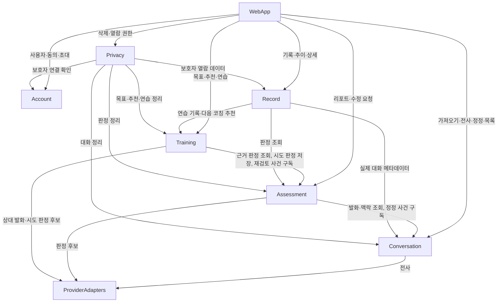

# Components — SCD 소통 코칭 MVP

**Stage**: domain-design (2.6)
**작성일**: 2026-09-17

## Sources

| 태그 | 출처 |
|---|---|
| `[req]` | `aidlc/spaces/default/intents/260916-scd-coaching-mvp/inception/requirements-analysis/requirements.md` |
| `[stories]` | `aidlc/spaces/default/intents/260916-scd-coaching-mvp/inception/user-stories/stories.md` |
| `[practices]` | `aidlc/spaces/default/intents/260916-scd-coaching-mvp/inception/practices-discovery/team-practices.md` |
| `[Q<n>]` | `domain-design-questions.md` — 이 단계에서 사용자가 답한 내용 |
| `[ADR-nnn]` | `decisions.md` |
| `[spec:02]`, `[spec:04]`, `[spec:05]`, `[spec:06]` | `docs/input/02_tech-environment.md`, `04_domain-model.md`, `05_synthetic-test-data.md`, `06_seed-scenarios.md` |
| `[log]` | `docs/decisions/decision-log.md` |

reverse-engineering(2.1)과 refined-mockups(2.5)는 범위 밖이다. 기존 아키텍처·컴포넌트 목록과
고충실도 화면 설계가 입력에 없는 것은 결손이 아니라 범위 밖이다.

**범위** — 이 문서는 코드로 작성할 논리 구성 요소와 엔티티의 **주인과 모양**(식별자, 속성 이름,
다른 컴포넌트 참조)만 정한다. 데이터 타입·제약·허용값·관계 수는 functional-design(3.1), 배포
형태는 units-generation(2.7), 기술·비기능 패턴은 3.x 단계가 정한다.

**컴포넌트 수** — 업무 컴포넌트는 6개다(Conversation, Assessment, Training, Record, Account,
Privacy) `[Q4][Q8]` (D-83). 여기에 기술 명세가 이미 자리를 정해 둔 **지원 컴포넌트 2개** —
화면 코드(WebApp, `frontend/`)와 STT·LLM 어댑터(ProviderAdapters, `providers/`) — 를 카탈로그에
함께 올려 의존 관계를 드러낸다 `[spec:02]` §6, `[practices]`. 지원 컴포넌트 둘은 이 단계의 새
결정이 아니다.

---

## 컴포넌트 카탈로그

```yaml
components:
  - name: WebApp
    summary: 모바일 웹 화면(A1~A5, A2-R, B1~B5, C1~C5, 실제 대화 목록, 보호자 읽기 화면)과 하단 탭·공통 안내
    behaviour: >
      화면 ID + 영어 역할 이름으로 페이지를 둔다. API 호출은 얇은 클라이언트 한 곳을 지나고 오류 봉투를
      타입 있는 오류로 바꾼다. 모든 비동기 화면은 로딩/성공/실패(다시 시도)/비어 있음 네 상태를 가진다.
      아직 없는 Should 화면으로 가는 버튼은 공통 "곧 볼 수 있어요" 안내를 띄운다(D-73). 첫 방문 동의 전에는
      다른 화면으로 가지 않는다. 판정 상태값·내부 용어를 화면에 그대로 내보내지 않고 관찰형 한국어 라벨로
      바꾼다. 전사·LLM 출력을 HTML 로 직접 주입하지 않는다. 한글 조합 중 Enter 와 중복 전송으로 시도가 두 번
      만들어지지 않게 한다. 프론트엔드에서 STT·LLM 을 직접 호출하지 않는다.
    responsibilities:
      - 화면 렌더링, 사용자 입력, 화면 상태 4종
      - 화면 간 이동과 목표 ID·원본 사건 ID 전달
      - 접근성(이름표, 색 보조 표시, 포커스 이동, 키보드 조작)
    depends_on:
      - component: Account
        interaction: 고정 사용자 조회, 첫 방문 동의 저장·조회, (Should) 로그인·보호자 초대
        style: sync
      - component: Conversation
        interaction: 가져오기·녹음 업로드, 전사·맥락 조회와 정정, 재분석 요청, 실제 대화 목록
        style: sync
      - component: Assessment
        interaction: 리포트 조회, "분석이 이상해요" 요청
        style: sync
      - component: Training
        interaction: 목표 추천·선택, 연습 목록·세션·시도·힌트, 다음 코칭 추천
        style: sync
      - component: Record
        interaction: 기록 목록, 목표별 추이, (Should) 상세 조회, 보호자 열람 화면 데이터
        style: sync
      - component: Privacy
        interaction: 삭제 요청·미리보기·처리 상태, 원음만 삭제, (Should) 열람 권한 전환
        style: sync
    dependents: []
    external_dependencies: []
    entities: []

  - name: ProviderAdapters
    summary: STT·LLM 제공자 어댑터(Mock 기본, live 선택)와 분석 모드 판별
    behaviour: >
      서비스 쪽 인터페이스(SttProvider, LlmProvider) 구현체를 둔다. 분석 모드가 미설정·빈 값·모르는 값이면
      Mock, live 인데 키가 없으면 기동을 거부한다. Mock STT 는 파일 이름의 conversationKey 로 합성 대화 전사를
      고르고, 키가 없거나 녹음이면 S1 로 처리한다(D-67). Mock LLM 은 conversationKey 와 전사 버전으로
      기대 판정 픽스처(정정 후 S3 포함)를 고르고, 연습 시도는 시나리오별 Mock 규칙으로 판정 후보를 낸다.
      제공자 예외는 어댑터 경계에서 앱 오류로 바꾸고, 연결·읽기 타임아웃과 타임아웃·연결 실패에만 1회 재시도한다.
      전사는 구분자로 감싼 데이터 블록으로만 프롬프트에 넣는다. 평가용·코칭용 프롬프트는 파일·버전이 분리된다.
      로그에 전사 본문을 남기지 않는다.
    responsibilities:
      - STT 전사, LLM 평가 후보 생성, LLM 코칭(상대 발화·힌트·시도 판정 후보)
      - 프롬프트 빌드와 프롬프트 버전 표기
      - 분석 모드 판별과 헬스체크 노출 값 제공
    depends_on: []
    dependents:
      - component: Conversation
        interaction: 음성 전사
      - component: Assessment
        interaction: 대화 판정 후보 생성
      - component: Training
        interaction: 모의 대화 상대 발화와 시도 판정 후보
    external_dependencies:
      - name: STT 제공자(미정, live 전용)
        kind: third-party-api
        purpose: 실제 음성 전사 — 기본 경로에서는 쓰지 않는다
      - name: LLM 제공자(미정, live 전용)
        kind: third-party-api
        purpose: 실제 판정·코칭 — 기본 경로에서는 쓰지 않는다
      - name: Mock 픽스처 파일
        kind: other
        purpose: 합성 대화 전사·기대 판정·시나리오 Mock 규칙의 단일 출처
    entities: []

  - name: Conversation
    summary: 실제 대화의 가져오기, 음성 파일, 전사, 맥락, 정정 이력
    behaviour: >
      업로드 전 녹음 알림 확인을 요구하고, 허용 형식·최대 크기·빈 파일을 디스크에 쓰기 전에 검증한다.
      녹음 최대 길이는 설정값이다. 처리 상태는 업로드 중 → 전사 중 → 완료 / 실패를 거친다. 대화에는 분석 중
      상태를 두어, 분석이 진행 중이면 새 분석 요청을 받지 않는다(AC3.3.4). 발화 수정·화자 변경·분석에서 빼기와
      되돌리기를 받고 수정마다 정정 이력을 남기며 전사 버전을 올린다. 정정이 일어나면 "발화 정정됨" 사건을
      프로세스 안에서 알린다(Assessment 가 받아 재검토 필요를 표시한다). 맥락 네 항목은 값과 상태(확인됨 /
      사용자 보고 / 미상)로 저장한다. 원음 보관 기간은 설정값이다. 쓰기는 DB 행(대기) → 파일 → DB 행(완료)
      순서다. 자기 데이터의 정리 인터페이스를 Privacy 에 노출한다.
    responsibilities:
      - 대화 생성과 처리 상태, 분석 중 상태
      - 음성 파일 저장과 메타데이터, 원음 보관 기간
      - 발화·정정 이력·전사 버전, 맥락
      - 실제 대화 목록
      - 대화 데이터 정리 인터페이스(삭제 전파용)
    depends_on:
      - component: ProviderAdapters
        interaction: 음성 전사 요청
        style: sync
    dependents:
      - component: WebApp
        interaction: 가져오기·전사 확인·정정·실제 대화 목록
      - component: Assessment
        interaction: 분석할 발화·맥락 조회, "발화 정정됨" 사건 구독
      - component: Record
        interaction: 기록 목록의 실제 대화 메타데이터 조회
      - component: Privacy
        interaction: 대화 데이터 정리(삭제 전파)
    external_dependencies:
      - name: PostgreSQL
        kind: database
        purpose: 대화·발화·정정·맥락·음성 메타데이터 저장
      - name: 로컬 파일 저장소(음성)
        kind: object-store
        purpose: 음성 파일 본문 — DB BLOB 에 넣지 않는다
    entities:
      - name: Conversation
        identifier: id
        attributes: [userId, source, status, conversationKey, transcriptVersion, audioAssetId, createdAt]
        references:
          - entity: User
            owned_by: Account
            relationship: 각 대화는 사용자 한 명에게 속한다
      - name: AudioAsset
        identifier: id
        attributes: [conversationId, path, durationSec, retentionUntil, deletedAt]
      - name: Utterance
        identifier: id
        attributes: [conversationId, seq, speaker, startMs, endMs, text, sttConfidence, unclear, excluded, edited]
      - name: Correction
        identifier: id
        attributes: [utteranceId, field, before, after, correctedAt]
      - name: ContextInfo
        identifier: conversationId
        attributes: [relation, place, purpose, userGoal]

  - name: Assessment
    summary: 실제 대화 분석과 판정 저장의 유일한 입구, 리포트, 분석 수정 요청
    behaviour: >
      분석 요청 시 Conversation 에서 발화·맥락을 읽어(분석에서 뺀 발화 제외) ProviderAdapters 로 판정 후보를
      받고, 서비스 규칙을 적용해 저장한다 — 관찰 기회 먼저, 결과와 보류 사유는 동시에 값을 갖지 않음, 근거는
      결과가 있는 판정에만 필수이고 보류는 근거가 있으면 저장·검증하며, 없는 발화 ID·뺀 발화를 가리키면
      INVALID_EVIDENCE(D-86), 불명확 발화·맥락 부족은 해당 보류 사유. 모든 판정에 버전 값 객체를 NOT NULL 로
      저장한다(D-81). 재분석은 같은 대화·같은 행동 묶음의 새 판정이 이전 판정을 "대체한 판정"으로 가리키게
      하고 이전 판정은 지우지 않는다(D-85). "발화 정정됨" 사건을 받으면 그 발화를 근거로 한 판정에 재검토
      필요를 표시하고 "판정 재검토 필요" 사건을 알린다. 연습 시도 판정도 Training 의 요청으로 같은 규칙을 거쳐
      저장한다(D-82). 리포트는 PARTIAL 을 잘한 장면·어려움 장면 두 곳에 배치하는 데 필요한 데이터를 준다(D-76).
      리포트 응답에 점수·등급·백분위 필드가 없다. 자기 데이터의 정리 인터페이스를 Privacy 에 노출한다.
    responsibilities:
      - 사회적 사건과 행동 판정(실제·모의), 근거
      - 판정 저장 규칙(근거 검증, 보류 규칙, 배타성, 버전 값 객체)
      - 재분석과 판정 대체 연결, 재검토 필요 표시
      - 리포트 데이터, "분석이 이상해요" 요청 저장
      - 판정 데이터 정리 인터페이스(삭제 전파용)
    depends_on:
      - component: Conversation
        interaction: 분석할 발화·맥락 조회, 분석 중 상태 전환, "발화 정정됨" 사건 구독
        style: event
      - component: ProviderAdapters
        interaction: 대화 판정 후보 요청
        style: sync
    dependents:
      - component: WebApp
        interaction: 리포트 조회, 분석 수정 요청
      - component: Training
        interaction: 추천 근거 판정 조회, 시도 판정 저장, "판정 재검토 필요" 사건 구독
      - component: Record
        interaction: 추이 집계용 판정 조회
      - component: Privacy
        interaction: 판정 데이터 정리(삭제 전파)
    external_dependencies:
      - name: PostgreSQL
        kind: database
        purpose: 사회적 사건·판정·근거·수정 요청 저장(가변 구조는 JSONB)
    entities:
      - name: SocialEvent
        identifier: id
        attributes: [conversationId, utteranceRange, summary, confirmedFacts, modelInferences]
        references:
          - entity: Conversation
            owned_by: Conversation
            relationship: 각 사회적 사건은 실제 대화 하나 안의 장면이다
      - name: BehaviorJudgment
        identifier: id
        attributes: [socialEventId, group, mode, performanceMode, opportunity, result, holdReason, rationale, alternatives, provenance, needsReview, supersedesJudgmentId, createdAt]
        references:
          - entity: Conversation
            owned_by: Conversation
            relationship: 실제 대화 판정은 사회적 사건을 거쳐 한 대화에 속한다 — 모의 대화 판정은 사회적 사건이 없고 시도가 판정을 가리킨다
      - name: Evidence
        identifier: id
        attributes: [judgmentId, utteranceIds, role]
        references:
          - entity: Utterance
            owned_by: Conversation
            relationship: 근거는 한 대화의 발화들을 가리킨다
      - name: AnalysisFeedback
        identifier: id
        attributes: [socialEventId, judgmentId, reasonType, description, createdAt]

  - name: Training
    summary: 목표, 추천(목표 추천·다음 코칭 추천), 시나리오, 모의 대화 세션·시도·힌트
    behaviour: >
      목표 추천(A5)은 리포트 판정에서 1~3개를 이유·원인 장면과 함께 만들고, 분석할 판정이 부족하면 충분성
      부족과 검토된 일반 연습을 준다. 다음 코칭 추천(C1)은 Must 에서 가장 최근 어려움 장면의 목표 하나를
      추천하고 어려움 장면이 없으면 추천하지 않는다 — 반복 어려움·도움 후 성공·선택 이력 반영은 Should
      (D-78, D-80). 선택 결과(받아들임/변경/거절)를 저장한다. 목표는 원본 사건·판정을 참조하며 원본이
      삭제되어 사용자가 "유지"를 고르면 참조를 비운다. 일반 연습 세션은 목표 없이 행동 묶음만 가진다.
      검토 완료된 원형과 기술 보존이 검토된 변형만 제공한다. 시도는 생성 후 수정 불가, 재시도는 순번 +1,
      힌트 이후 시도는 도움 후 시도다. 빈 입력·"그만" 완전 일치는 일시정지, "몰라"·"도와줘" 완전 일치는
      힌트 제안이다. 시도 판정 후보를 ProviderAdapters 에서 받아 Assessment 로 저장한다. "판정 재검토 필요"
      사건을 받으면 관련 추천을 재계산 대기로 둔다. 자기 데이터의 정리 인터페이스를 Privacy 에 노출한다.
    responsibilities:
      - 목표와 목표 추천·다음 코칭 추천
      - 시나리오 원형·변형
      - 연습 세션·시도·힌트, 일시정지·재개
      - 목표·추천·연습 데이터 정리 인터페이스(삭제 전파용, 유지 시 참조 비우기)
    depends_on:
      - component: Assessment
        interaction: 추천 근거 판정 조회, 시도 판정 저장, "판정 재검토 필요" 사건 구독
        style: sync
      - component: ProviderAdapters
        interaction: 모의 대화 상대 발화와 시도 판정 후보 요청
        style: sync
    dependents:
      - component: WebApp
        interaction: 목표·추천·연습 화면
      - component: Record
        interaction: 연습 기록 조회, 다음 코칭 추천 조회
      - component: Privacy
        interaction: 목표·추천·연습 정리와 "유지" 처리(삭제 전파)
    external_dependencies:
      - name: PostgreSQL
        kind: database
        purpose: 목표·추천·시나리오·세션·시도·힌트 저장(변형 규칙은 JSONB)
    entities:
      - name: TrainingGoal
        identifier: id
        attributes: [userId, sourceEventId, sourceJudgmentId, group, title, status, selectedBy]
        references:
          - entity: User
            owned_by: Account
            relationship: 각 목표는 사용자 한 명의 것이다
          - entity: SocialEvent
            owned_by: Assessment
            relationship: 목표는 원인이 된 장면 하나를 가리킬 수 있다(원본 삭제 후 유지하면 비워진다)
          - entity: BehaviorJudgment
            owned_by: Assessment
            relationship: 목표는 원인이 된 판정 하나를 가리킬 수 있다(원본 삭제 후 유지하면 비워진다)
      - name: Recommendation
        identifier: id
        attributes: [userId, kind, goalId, reason, sourceIds, sufficiency, userChoice, recalculationPending, createdAt]
        references:
          - entity: User
            owned_by: Account
            relationship: 각 추천은 사용자 한 명에게 주어진다
      - name: ScenarioTemplate
        identifier: id
        attributes: [group, title, situation, partnerRole, ageBand, reviewStatus]
      - name: ScenarioVariant
        identifier: id
        attributes: [templateId, variationRules, distance, skillPreserved]
      - name: PracticeSession
        identifier: id
        attributes: [userId, goalId, templateId, variantId, group, status]
        references:
          - entity: User
            owned_by: Account
            relationship: 각 연습 세션은 사용자 한 명의 것이다
      - name: Attempt
        identifier: id
        attributes: [sessionId, order, performanceMode, responseText, judgmentId, provenance, createdAt]
        references:
          - entity: BehaviorJudgment
            owned_by: Assessment
            relationship: 각 시도는 판정 하나를 가진다(판정 저장은 Assessment)
      - name: HintEvent
        identifier: id
        attributes: [sessionId, attemptOrder, level, content]

  - name: Record
    summary: 기록 목록과 목표별 추이 집계(읽기 중심), 상세 조회와 보호자 열람 데이터
    behaviour: >
      자기 엔티티를 가지지 않고 다른 컴포넌트의 데이터를 읽어 보여 준다. 추이 분모는 관찰 기회가 있고 보류가
      없는 판정만 세고, 실제 대화와 모의 대화, 독립 수행과 도움 후 수행을 섞지 않는다. 재검토 필요 판정은
      재분석 전에는 세고, 대체되면 대체한 판정만 센다(D-74, D-85). 유효 기회가 설정값(기본 3) 미만이면 숫자
      대신 비교 불충분을 준다. 다음 코칭 추천은 Training 에서 받아 C1 에 싣는다. 내부 용어("유효 기회",
      "분모")를 응답 라벨로 내보내지 않는다. (Should) 보호자 열람 데이터는 Privacy 의 권한 판정을 받아
      SUMMARY 는 목표·추이, FULL 은 리포트까지, 전사 원문·원음은 주지 않는다.
    responsibilities:
      - 기록 목록(실제·모의 필터)
      - 목표별 추이 집계와 비교 불충분 판정
      - (Should) 목표·연습·실제 대화 상세 조회, 보호자 열람 데이터
    depends_on:
      - component: Conversation
        interaction: 실제 대화 메타데이터 조회
        style: sync
      - component: Assessment
        interaction: 추이 집계용 판정 조회
        style: sync
      - component: Training
        interaction: 연습 기록·목표·다음 코칭 추천 조회
        style: sync
    dependents:
      - component: WebApp
        interaction: 기록·추이·상세·보호자 열람 화면
      - component: Privacy
        interaction: (Should) 권한에 맞춘 보호자 열람 데이터 요청
    external_dependencies: []
    entities: []

  - name: Account
    summary: 사용자, 첫 방문 동의, 로그인, 보호자 계정과 초대
    behaviour: >
      Must 경로는 시드된 고정 사용자 하나로 돈다. 시드 사용자는 동의 전 상태로 시작하고, 동의는 사용자 단위로
      서버에 저장한다. (Should) 사용자는 자기 계정을 직접 만든다 — 보호자가 사용자 계정을 대신 만드는 경로는
      없다. 보호자는 자기 계정으로 로그인하고 사용자가 만든 초대 코드로 연결된다. 사용자 삭제 기능은 이번
      범위에 없으므로 삭제 전파 대상이 아니다(D-83).
    responsibilities:
      - 사용자와 역할(주 사용자 / 보호자)
      - 첫 방문 동의 상태
      - (Should) 회원가입·로그인·세션, 보호자 초대 코드와 수락
    depends_on: []
    dependents:
      - component: WebApp
        interaction: 사용자·동의·로그인·초대
      - component: Privacy
        interaction: 보호자 연결 확인(열람 권한 대상)
    external_dependencies:
      - name: PostgreSQL
        kind: database
        purpose: 사용자·동의·초대 저장
    entities:
      - name: User
        identifier: id
        attributes: [displayName, role, ageBand, languageBackground, consentedAt, createdAt]
      - name: GuardianInvitation
        identifier: id
        attributes: [userId, code, expiresAt, acceptedByUserId, acceptedAt]
        references:
          - entity: User
            owned_by: Account
            relationship: 초대는 사용자 한 명이 만들고 보호자 한 명이 수락한다

  - name: Privacy
    summary: 삭제 요청과 삭제 전파의 유일한 진입점, 원음만 삭제, 보호자 열람 권한
    behaviour: >
      대화 삭제 요청 시 삭제될 연결 항목(전사·판정·연결된 연습·추천) 미리보기를 만들고 확인 전에는 아무것도
      지우지 않는다. 목표·추천은 사용자에게 함께 삭제/유지를 받는다. 확인하면 지울 파일 경로를 영향 항목에
      먼저 기록하고, 한 트랜잭션 안에서 Conversation·Assessment·Training 의 정리 인터페이스를 순서대로 불러
      DB 행을 지운 뒤 커밋하고, 이어서 파일을 지운다. 커밋 후 파일 삭제에 실패한 경로는 요청 상태를 일부 완료로
      남기고 다시 삭제 요청 시 그 경로만 지운다(D-84). 삭제 목록에는 맥락과 분석 수정 요청이 포함된다.
      FK 연쇄 삭제는 그물로만 쓰고, 목표의 원본 참조는 연쇄가 아니라 비우기다. 원음만 삭제는 파일을 지우고
      음성 메타데이터에 삭제 시각을 남긴다. (Should) 보호자 열람 권한은 NONE / SUMMARY / FULL, 기본 NONE,
      사용자만 바꾼다. 미성년 사용자에게만 제공한다.
    responsibilities:
      - 삭제 요청·미리보기·처리 상태·영향 항목
      - 삭제 전파 조율(유일한 진입점)과 남은 파일 추적
      - 원음만 삭제
      - (Should) 보호자 열람 권한과 권한 판정
    depends_on:
      - component: Conversation
        interaction: 대화 데이터 정리, 원음 파일 삭제
        style: sync
      - component: Assessment
        interaction: 판정 데이터 정리
        style: sync
      - component: Training
        interaction: 목표·추천·연습 정리, 유지 시 원본 참조 비우기
        style: sync
      - component: Account
        interaction: 보호자 연결 확인
        style: sync
      - component: Record
        interaction: (Should) 권한에 맞춘 보호자 열람 데이터
        style: sync
    dependents:
      - component: WebApp
        interaction: 삭제·원음 삭제·열람 권한 화면
    external_dependencies:
      - name: PostgreSQL
        kind: database
        purpose: 삭제 요청·열람 권한 저장
      - name: 로컬 파일 저장소(음성)
        kind: object-store
        purpose: 커밋 후 음성 파일 삭제(Conversation 정리 인터페이스 경유)
    entities:
      - name: DeletionRequest
        identifier: id
        attributes: [userId, targetType, targetId, goalDisposition, affectedItems, pendingFilePaths, status, note, createdAt]
        references:
          - entity: User
            owned_by: Account
            relationship: 각 삭제 요청은 사용자 한 명이 한다
      - name: SharingSetting
        identifier: id
        attributes: [userId, supporterId, level]
        references:
          - entity: User
            owned_by: Account
            relationship: 사용자 한 명과 보호자 한 명 사이의 열람 권한이다
```

---

## Component Diagram



<!-- Text fallback: WebApp 이 여섯 업무 컴포넌트(Account, Conversation, Assessment, Training, Record, Privacy)를 모두 호출한다. Conversation, Assessment, Training 은 ProviderAdapters 를 호출한다. Assessment 는 Conversation 을 읽고 정정 사건을 구독한다. Training 은 Assessment 를 읽고 시도 판정을 저장하며 재검토 사건을 구독한다. Record 는 Conversation, Assessment, Training 을 읽는다. Privacy 는 Conversation, Assessment, Training 의 정리 인터페이스와 Account, Record 를 부른다. 순환은 없다. -->

의존 방향은 한 방향이다: `WebApp → Privacy → Record → Training → Assessment → Conversation →
ProviderAdapters`, 그리고 `Account` 는 아무것도 부르지 않는다. 정정 → 재검토 → 추천 재계산은 아래
방향 호출이 아니라 **프로세스 안 사건**으로 흘러 순환을 만들지 않는다 `[ADR-009]`.

## Component Summary

| Component | Purpose | Depends On | Dependents | Entities Owned |
|---|---|---|---|---|
| WebApp | 모바일 웹 화면과 공통 안내·상태 | Account, Conversation, Assessment, Training, Record, Privacy | — | — |
| ProviderAdapters | STT·LLM 어댑터(Mock 기본), 분석 모드 | — | Conversation, Assessment, Training | — |
| Conversation | 가져오기·음성·전사·맥락·정정 | ProviderAdapters | WebApp, Assessment, Record, Privacy | Conversation, AudioAsset, Utterance, Correction, ContextInfo |
| Assessment | 판정 저장의 유일한 입구, 리포트 | Conversation, ProviderAdapters | WebApp, Training, Record, Privacy | SocialEvent, BehaviorJudgment, Evidence, AnalysisFeedback |
| Training | 목표·추천·시나리오·연습 | Assessment, ProviderAdapters | WebApp, Record, Privacy | TrainingGoal, Recommendation, ScenarioTemplate, ScenarioVariant, PracticeSession, Attempt, HintEvent |
| Record | 기록·추이 집계(읽기 중심) | Conversation, Assessment, Training | WebApp, Privacy | — |
| Account | 사용자·동의·로그인·보호자 초대 | — | WebApp, Privacy | User, GuardianInvitation |
| Privacy | 삭제 전파 진입점·원음 삭제·열람 권한 | Conversation, Assessment, Training, Account, Record | WebApp | DeletionRequest, SharingSetting |

## Entity Ownership

| Entity | Owning Component | Identifier | Attributes | References |
|---|---|---|---|---|
| Conversation | Conversation | id | userId, source, status, conversationKey, transcriptVersion, audioAssetId, createdAt | User (Account) |
| AudioAsset | Conversation | id | conversationId, path, durationSec, retentionUntil, deletedAt | — |
| Utterance | Conversation | id | conversationId, seq, speaker, startMs, endMs, text, sttConfidence, unclear, excluded, edited | — |
| Correction | Conversation | id | utteranceId, field, before, after, correctedAt | — |
| ContextInfo | Conversation | conversationId | relation, place, purpose, userGoal | — |
| SocialEvent | Assessment | id | conversationId, utteranceRange, summary, confirmedFacts, modelInferences | Conversation (Conversation) |
| BehaviorJudgment | Assessment | id | socialEventId, group, mode, performanceMode, opportunity, result, holdReason, rationale, alternatives, provenance, needsReview, supersedesJudgmentId, createdAt | Conversation (Conversation, 사회적 사건 경유) |
| Evidence | Assessment | id | judgmentId, utteranceIds, role | Utterance (Conversation) |
| AnalysisFeedback | Assessment | id | socialEventId, judgmentId, reasonType, description, createdAt | — |
| TrainingGoal | Training | id | userId, sourceEventId, sourceJudgmentId, group, title, status, selectedBy | User (Account), SocialEvent·BehaviorJudgment (Assessment, 삭제 후 유지 시 비움) |
| Recommendation | Training | id | userId, kind, goalId, reason, sourceIds, sufficiency, userChoice, recalculationPending, createdAt | User (Account) |
| ScenarioTemplate | Training | id | group, title, situation, partnerRole, ageBand, reviewStatus | — |
| ScenarioVariant | Training | id | templateId, variationRules, distance, skillPreserved | — |
| PracticeSession | Training | id | userId, goalId, templateId, variantId, group, status | User (Account) |
| Attempt | Training | id | sessionId, order, performanceMode, responseText, judgmentId, provenance, createdAt | BehaviorJudgment (Assessment) |
| HintEvent | Training | id | sessionId, attemptOrder, level, content | — |
| User | Account | id | displayName, role, ageBand, languageBackground, consentedAt, createdAt | — |
| GuardianInvitation | Account | id | userId, code, expiresAt, acceptedByUserId, acceptedAt | User (Account) |
| DeletionRequest | Privacy | id | userId, targetType, targetId, goalDisposition, affectedItems, pendingFilePaths, status, note, createdAt | User (Account) |
| SharingSetting | Privacy | id | userId, supporterId, level | User (Account) |

**도메인 모델과 달라진 점** `[spec:04]` 대비 — 이 표가 기준이다.

| 달라진 것 | 이유 |
|---|---|
| `VersionInfo` 엔티티 없음 → 판정·시도의 `provenance` 값 객체(기준·프롬프트·모델·전사 버전) | D-81 `[ADR-003]` |
| `BehaviorJudgment.versionInfoId` → `provenance`, `supersedesJudgmentId` 추가 | D-81, D-85 `[ADR-003][ADR-007]` |
| `Recommendation` 은 Training 소유, `kind`(목표 추천 / 다음 코칭 추천)와 `recalculationPending` 추가 | D-80, FR3.3 `[ADR-002]` |
| `Conversation.status` 에 분석 중 상태, `conversationKey` 추가 | AC3.3.4 해석(요약 확인), D-67 |
| `User.role`, `User.consentedAt`, `GuardianInvitation` 추가 — Account 소유 | D-69, D-83, AC1.1.3 `[ADR-005]` |
| `AnalysisFeedback` 추가 | D-65 |
| `PracticeSession.goalId` 는 비어 있을 수 있음(일반 연습), `userId`·`templateId`·`group` 추가 | D-77 |
| `DeletionRequest.pendingFilePaths`, `goalDisposition` 추가 | D-84 `[ADR-006]` |

## External Dependencies

| Component | Dependency | Kind | Purpose |
|---|---|---|---|
| ProviderAdapters | STT 제공자(미정, live 전용) | third-party-api | 실제 음성 전사 — 기본 경로에서는 쓰지 않는다 |
| ProviderAdapters | LLM 제공자(미정, live 전용) | third-party-api | 실제 판정·코칭 — 기본 경로에서는 쓰지 않는다 |
| ProviderAdapters | Mock 픽스처 파일 | other | 합성 대화 전사·기대 판정·시나리오 Mock 규칙의 단일 출처 |
| Conversation | PostgreSQL | database | 대화·발화·정정·맥락·음성 메타데이터 |
| Conversation | 로컬 파일 저장소(음성) | object-store | 음성 파일 본문 |
| Assessment | PostgreSQL | database | 사회적 사건·판정·근거·수정 요청 |
| Training | PostgreSQL | database | 목표·추천·시나리오·세션·시도·힌트 |
| Account | PostgreSQL | database | 사용자·동의·초대 |
| Privacy | PostgreSQL | database | 삭제 요청·열람 권한 |
| Privacy | 로컬 파일 저장소(음성) | object-store | 커밋 후 음성 파일 삭제 |

## Rationale

| Component | 왜 따로인가 |
|---|---|
| WebApp | 화면 코드는 백엔드와 언어·빌드·테스트 도구가 다르고 변경 속도가 가장 빠르다 |
| ProviderAdapters | 외부 제공자 교체(Mock ↔ live)를 업무 규칙에서 숨기는 포트·어댑터 경계. 제공자가 미정이라 가장 바뀌기 쉽다 |
| Conversation | 음성·전사라는 입력 데이터의 수명(업로드 → 전사 → 정정 → 보관 기간)이 따로 있다 |
| Assessment | 판정 규칙(관찰 기회·보류·근거·대체)이 이 서비스의 핵심 업무 규칙이고, 실제·모의 판정이 같은 규칙으로 저장되어야 한다 `[ADR-004][ADR-008]` |
| Training | 목표를 정하고 연습하는 흐름과 그 추천이 한 사용자 결정의 흐름으로 함께 바뀐다 `[ADR-002]` |
| Record | 여러 컴포넌트의 데이터를 읽어 모으는 집계·조회 전용. 자기 데이터를 가지지 않아 다른 컴포넌트를 순환 없이 읽는다 `[ADR-010]` |
| Account | 사용자·동의·로그인·보호자 계정은 개인정보 처리(권한·삭제)와 변경 이유가 다르다 `[ADR-005]` |
| Privacy | 삭제 전파가 한 곳에서만 시작해야 R3(삭제 누수)을 막는다 `[ADR-006]` |

### Alternatives Rejected

- **추천을 Record 에(명세 패키지 구조)** — 목표 추천 규칙이 리포트 판정과 연습 목표 생성 사이에서 Record 를 거쳐 가야 하고, 추천의 결과(목표)는 Training 에 있다. 사용자가 Training 을 골랐다 `[Q1]`
- **VersionInfo 를 Record 가 가지는 별도 엔티티로** — Assessment ↔ Record 순환이 생긴다 `[Q2]`
- **모의 대화 판정을 Training 별도 엔티티로** — 판정 규칙이 두 곳에 복제되고 Record 가 두 엔티티를 합쳐야 한다 `[Q3]`
- **사용자·동의를 Privacy 에** — 한 컴포넌트가 계정 관리와 삭제·권한을 모두 맡아 변경 이유가 섞인다 `[Q4]`
- 삭제 전파·재분석·근거 예외의 기각안은 `decisions.md` ADR-006~ADR-008 에 있다

## Assumptions & Open Questions

### 가정

| 가정 | 틀렸을 때 | 출처 |
|---|---|---|
| 재분석의 대체 연결은 같은 대화·같은 행동 묶음의 새 판정이 이전 판정을 가리키는 것이다 | 전사 정정으로 사회적 사건 구분이 달라지면 묶음 단위 대체가 장면을 잘못 잇는다 — 이때는 대화 단위 대체로 바꾼다 | `[Q6]` (D-85), 요약 확인에서 해석으로 확인 |
| "분석 중 다시 누르기" 방지는 대화의 분석 중 상태로 한다 | 동시 요청이 상태 확인을 동시에 통과할 수 있다 — 3.3 NFR 설계에서 잠금 방식을 정한다 | AC3.3.4, 요약 확인에서 해석으로 확인 |
| 프로세스 안 사건(정정됨, 재검토 필요)은 같은 요청 트랜잭션 안에서 동기적으로 처리된다 | 비동기로 하면 재검토 표시가 늦게 보인다 | `[ADR-009]` |

### 열린 질문

| 질문 | 담당 단계 | 출처 |
|---|---|---|
| 엔티티 속성의 타입·제약·허용값, 정정 후 S3 픽스처의 나머지 판정 값 | functional-design(3.1), 픽스처 작성 | `[stories]` 열린 질문 |
| 삭제 트랜잭션의 정리 순서(컴포넌트 호출 순서)와 FK 설정의 구체값 | functional-design(3.1) | `[ADR-006]` |
| 분석 중 상태의 동시성 처리 방식 | nfr-design(3.3) | 가정 2 |
| 기술 명세 `02_tech-environment.md` §6 패키지 구조를 6개 업무 이름(account 추가, 추천은 training)으로 고칠 시점 | functional-design(3.1) 착수 전 | D-80, D-83 |
| 팀 관행 문서의 "5개 이름"·삭제 잠정 규칙과 이 설계의 차이 기록 | 이 단계의 배움 기록(§13) | D-83, D-84 |
