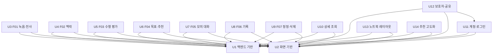

# Unit of Work Dependency — SCD 소통 코칭 MVP

**Stage**: units-generation (2.7)
**작성일**: 2026-09-17

## Sources

| 태그 | 출처 |
|---|---|
| `[unit-of-work]` | `unit-of-work.md` — 단위 정의(같은 디렉터리) |
| `[components]` | `aidlc/spaces/default/intents/260916-scd-coaching-mvp/inception/domain-design/components.md` — 컴포넌트 의존·사건 |
| `[decisions]` | `aidlc/spaces/default/intents/260916-scd-coaching-mvp/inception/domain-design/decisions.md` — ADR-004, ADR-006, ADR-009 |
| `[stories]` | `aidlc/spaces/default/intents/260916-scd-coaching-mvp/inception/user-stories/stories.md` — 스토리 의존과 핵심 경로 |
| `[Q<n>]` | `units-generation-questions.md` |

**이 문서는 위상(topology)만 적는다.** 추천 빌드 순서와 핵심 경로(critical path)는 여기서 고르지 않는다 —
그것은 이 DAG 를 입력으로 delivery-planning(2.9)이 정한다.

**의존의 뜻** — 아래의 "A 는 B 에 의존한다"는 **B 의 구현이 끝나야 A 를 시작할 수 있다**는 뜻이다. 기능 단위
사이의 데이터·화면 연결은 구현 완료 의존이 아니라 계약(2.8)과 시드·픽스처로 대신한다 `[Q5]` (D-92). 그래서
기능 단위 사이의 연결은 아래 "통합 지점" 표에만 있고 DAG 의 간선에는 없다.

---

## 의존 DAG



<!-- Text fallback: 화살표는 "왼쪽이 오른쪽에 의존한다"이다. U1 백엔드 기반과 U2 화면 기반은 아무것에도 의존하지 않는다. U3~U14 의 모든 단위는 U1 과 U2 에 의존한다. 그 밖의 간선은 U12 보호자·공유가 U11 계정·로그인에 의존하는 것 하나뿐이다. 순환은 없다. -->

텍스트로: U1·U2 는 의존 없음. U3~U14 는 모두 U1·U2 에 의존. 추가 간선은 U12 → U11 하나. 순환 없음.

### 간선 블록

```yaml
units:
  - name: u1-backend-foundation
    kind: service
    depends_on: []
  - name: u2-web-foundation
    kind: ui
    depends_on: []
  - name: u3-f01-capture
    depends_on: [u1-backend-foundation, u2-web-foundation]
  - name: u4-f02-context
    depends_on: [u1-backend-foundation, u2-web-foundation]
  - name: u5-f03-assessment
    depends_on: [u1-backend-foundation, u2-web-foundation]
  - name: u6-f04-goal
    depends_on: [u1-backend-foundation, u2-web-foundation]
  - name: u7-f05-practice
    depends_on: [u1-backend-foundation, u2-web-foundation]
  - name: u8-f06-record
    depends_on: [u1-backend-foundation, u2-web-foundation]
  - name: u9-f07-correction-deletion
    depends_on: [u1-backend-foundation, u2-web-foundation]
  - name: u10-s-detail-views
    depends_on: [u1-backend-foundation, u2-web-foundation]
  - name: u11-s-account-auth
    depends_on: [u1-backend-foundation, u2-web-foundation]
  - name: u12-s-guardian-sharing
    depends_on: [u1-backend-foundation, u2-web-foundation, u11-s-account-auth]
  - name: u13-s-laptop-layout
    kind: ui
    depends_on: [u1-backend-foundation, u2-web-foundation]
  - name: u14-s-recommendation-plus
    depends_on: [u1-backend-foundation, u2-web-foundation]
```

`kind` 를 적지 않은 단위는 백엔드와 화면을 함께 담아 한 종류로 줄일 수 없는 단위다 `[unit-of-work]`.

---

## 통합 지점

기능 단위 사이의 연결이다. 모두 **계약(2.8)으로 먼저 고정하고, 앞 단위가 아직 없으면 시드·픽스처로 대신한다**
`[Q5]`. 방식은 도메인 설계의 컴포넌트 의존 style 을 따른다 `[components]`.

| # | 제공 단위 → 사용 단위 | 연결 내용 | 방식 | 앞 단위가 없을 때 대신하는 것 |
|---|---|---|---|---|
| I1 | U3 → U5 | 전사가 끝난 대화의 발화 조회, 분석 중 상태 전환 | API(프로세스 안 호출) | 합성 대화 S1~S3 발화 시드 |
| I2 | U4 → U5 | 분석 전제인 맥락 네 항목 조회 | API(프로세스 안 호출) | 맥락 시드(값·미상 섞음) |
| I3 | U5 → U6 | 리포트 판정·사회적 사건 조회(목표 추천 근거) | API(프로세스 안 호출) | "S1 분석 완료" 판정 시드 |
| I4 | U6 → U7 | 선택된 목표 ID 로 연습 시작 | 화면 이동 + API | "목표 선택됨" 시드 |
| I5 | U5 → U7 | 연습 시도 판정을 Assessment 저장 규칙으로 저장(ADR-004) — U7 이 저장을 요청하고 U5 의 저장 규칙이 저장한다 | API(프로세스 안 호출) | U5 전에는 저장 규칙 없는 임시 저장 금지 — 계약의 저장 함수 서명을 먼저 고정한다 |
| I6 | U3·U5·U6·U7 → U8 | 실제 대화 메타데이터, 추이 집계용 판정, 연습 기록·목표 조회 | API(프로세스 안 호출) | 판정·시도 누적 시드 |
| I7 | U3 → U9 | "발화 정정됨" 사건(ADR-009) | 프로세스 안 사건 | 사건 계약과 테스트용 발행기 |
| I8 | U5 → U9 → U6 | 재검토 필요 표시, "판정 재검토 필요" 사건, 추천 재계산 대기 | 프로세스 안 사건 | 사건 계약 |
| I9 | U3·U5·U6·U7 → U9 | 각 컴포넌트의 데이터 정리 인터페이스(삭제 전파, ADR-006) | API(프로세스 안 호출, 한 트랜잭션) | 정리 인터페이스 서명을 계약으로 고정, U9 가 구현 |
| I10 | U2 → U3~U14 | 앱 틀, API 클라이언트, 화면 상태 4종, "곧 볼 수 있어요" | 프론트엔드 공통 코드 | 없음 — 구현 완료 의존 |
| I11 | U1 → U3~U14 | 설정, DB 세션, 오류 봉투, Mock 어댑터, 시드 사용자 | 백엔드 공통 코드 | 없음 — 구현 완료 의존 |
| I12 | U11 → U12 | 로그인한 보호자 식별, 인증 확인 | API | 없음 — 구현 완료 의존 `[Q6]` |
| I13 | U8 → U10, U12, U14 | Record 조회 응답 모양, 다음 코칭 추천 규칙 자리 | API | 계약 |
| I14 | 모든 화면 단위 → U13 | 넓은 화면에서 다시 점검할 화면 목록 | 프론트엔드 공통 코드 | 점검 대상이 없는 화면은 건너뛴다 |

**공유 데이터** — 단위는 컴포넌트를 가로지르므로 같은 테이블·같은 모듈 파일을 여러 단위가 만진다. 자리별 나누는
방법은 `unit-of-work.md` 의 "같은 코드를 여러 단위가 만지는 자리" 표에 있다. 마이그레이션 담당은 열린 질문
OQ-U1(담당: contract-design 2.8)이다.

---

## 병렬 개발 기회

의존 관계만으로 본 "서로 의존이 없어 함께 진행할 수 있는 집합"이다. 동시에 진행하는 갈래는 최대 4개로
확정되어 있다 `[Q4]` (D-91). 어느 집합을 어느 갈래에 어떤 순서로 둘지는 2.9 가 정한다.

| 집합 | 단위 | 조건 |
|---|---|---|
| P1 | U1, U2 | 의존 없음 — 처음부터 함께 진행 가능 |
| P2 | U3, U4, U5, U6, U7, U8, U9, U10, U11, U13, U14 | U1·U2 가 끝나면 서로 의존 없이 진행 가능 (계약 합의 전제) |
| P3 | U12 | U1·U2·U11 이 끝나면 진행 가능 |

유효한 위상 정렬은 여러 가지다. 예를 들어 U1, U2 뒤에 P2 의 어떤 순서든, U12 는 U11 뒤 어느 자리든 가능하다.

**주의** — 간선이 없다고 해서 통합 시점까지 독립인 것은 아니다. US9.3(SM1 종단 리허설, U8)의 수용 기준(AC9.3.1)은
동의부터 기록까지의 흐름이 지나는 U2~U7 이 모두 통합되어야 통과한다. 이 조건은 DAG 간선이 아니라 열린 질문 OQ-U3(담당: delivery-planning 2.9)로
넘긴다 `[stories]`.
